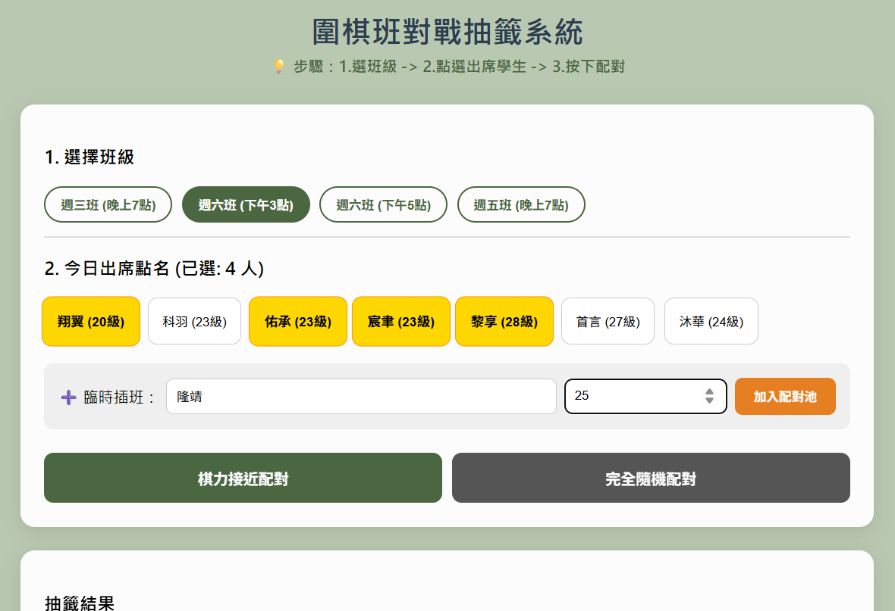
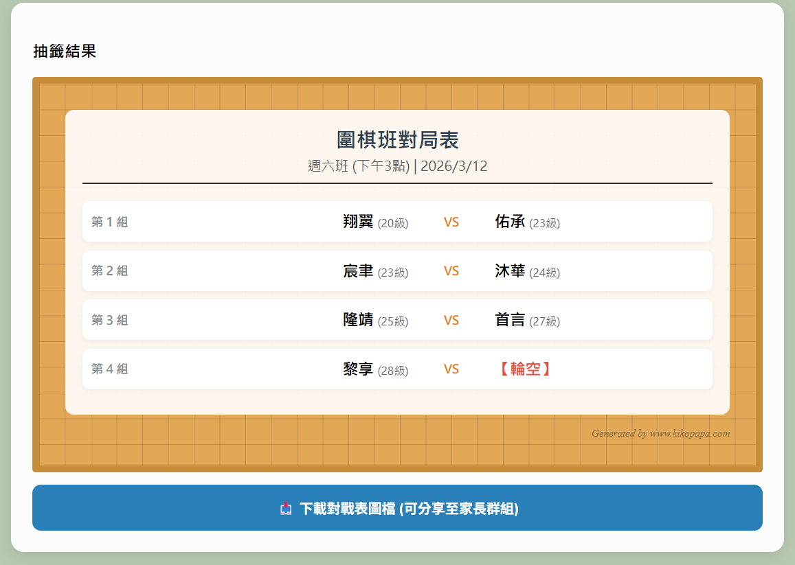

## 緣起：
平常幫學生安排兩兩對弈，常常要花不少心力😅 (什麼「不公平啦～」「我不要跟他下啦～」的聲音一直傳來🤣)
於是 最近我做了一個小小的網頁程式，可以自動配對對弈。
如果有需要的老師，我很樂意分享，讓大家省心又省事 

V1
1. 行動裝置友善版
2. 歷史紀錄
   
V2 
https://storage.googleapis.com/gopairing/GoPairingTool-v9.html
1. 免打字：班級名單預載入進去，只要點選即可.
2. 如遇到臨時插班學生，旁邊有個框框直接輸入，也可以加入配對。
3. 更專業：一鍵匯出「對戰表」圖檔，發給家長群組超方便！

